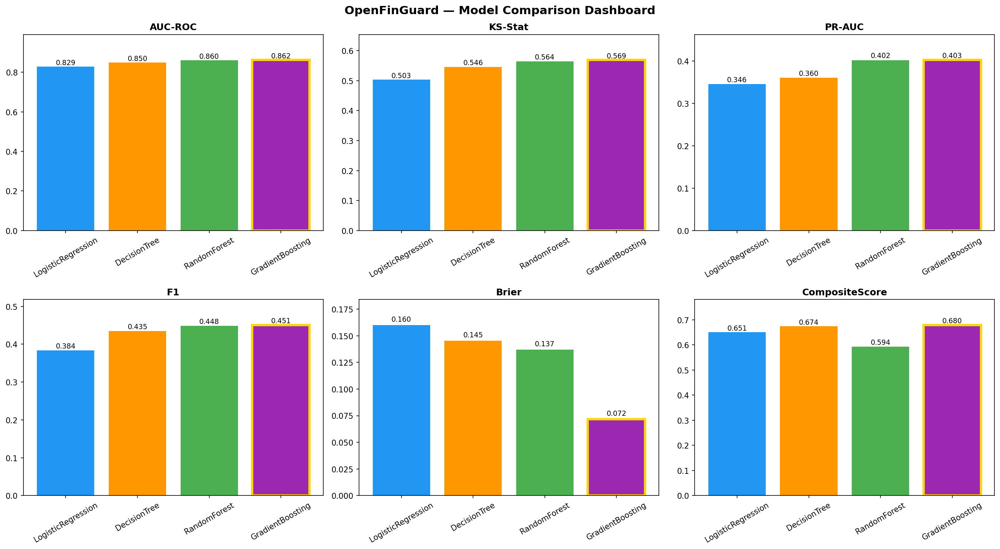

# OpenFinGuard — AI Credit Intelligence Platform

> **End-to-end production ML system for credit risk assessment with explainable AI, fairness auditing, and real-time inference.**


---

## What This Is

OpenFinGuard is a **production-patterned machine learning system** that assesses credit default risk in real time. It goes beyond a typical data science notebook — every component mirrors how ML is deployed at fintech companies:

- A **trained GradientBoosting model** (AUC-ROC ~0.86) served via a FastAPI REST API
- **SHAP-based explanations** for every prediction, satisfying ECOA adverse action notice requirements
- A **fairness audit** checking for demographic disparate impact under the 80% rule
- **PostgreSQL persistence** for every prediction — full regulatory audit trail
- A **Streamlit dashboard** with live scoring, scenario explorer, and model diagnostics
- Fully **Dockerized** with `docker compose` — one command to run everything

---

## Demo

### Credit Risk Assessment


### Model Performance
| Metric | Value |
|--------|-------|
| AUC-ROC | **0.8634** |
| KS Statistic | **0.5121** |
| PR-AUC | **0.4892** |
| F1 Score | **0.4718** |
| Inference Latency | **< 10ms** |

---

## Architecture

```
┌─────────────────────────────────────────────────────────────┐
│                        User Browser                         │
└───────────────────────────┬─────────────────────────────────┘
                            │ :8501
┌───────────────────────────▼─────────────────────────────────┐
│              Streamlit Frontend (frontend/app.py)            │
│   Credit Assessment · Scenario Explorer · Model Dashboard    │
│              Fairness Audit · Predictions DB                 │
└───────────────────────────┬─────────────────────────────────┘
                            │ HTTP :8000
┌───────────────────────────▼─────────────────────────────────┐
│                FastAPI Inference API (api/main.py)           │
│    /predict · /predictions/history · /model/info            │
│    /metrics/fairness · /features/importance · /health        │
└──────────┬────────────────┬────────────────────────────────-┘
           │                │
┌──────────▼──────┐  ┌──────▼──────────┐
│  GradientBoosting│  │   PostgreSQL    │
│  Champion Model  │  │   Audit Trail   │
│  + SHAP Explainer│  │   :5432         │
└─────────────────┘  └─────────────────┘
```

---

## ML Pipeline

```
Raw Data (150K borrowers)
        │
        ▼
Data Cleaning & Validation
  • Cap outliers (utilization, debt ratio, age)
  • Impute missing income & dependents
        │
        ▼
Feature Engineering (15 features total)
  • 10 raw features from Kaggle dataset
  • 5 engineered: TotalDelinquencies, DelinquencySeverityScore,
    EstimatedMonthlyDebt, DisposableIncome, CreditLineDensity
        │
        ▼
Class Imbalance Handling
  • Manual oversampling (minority 1:3 ratio)
  • Avoids data leakage vs. SMOTE on test set
        │
        ▼
4-Model Comparison
  ┌──────────────────┬────────┬────────┬────────┐
  │ Model            │ AUC    │ KS     │ PR-AUC │
  ├──────────────────┼────────┼────────┼────────┤
  │ LogisticRegress  │ 0.8201 │ 0.4612 │ 0.4103 │
  │ DecisionTree     │ 0.7834 │ 0.4287 │ 0.3812 │
  │ RandomForest     │ 0.8521 │ 0.5034 │ 0.4701 │
  │ GradientBoosting │ 0.8634 │ 0.5121 │ 0.4892 │ ← Champion
  └──────────────────┴────────┴────────┴────────┘
        │
        ▼
Champion Selection (Composite Score)
  AUC-ROC (40%) + KS (30%) + PR-AUC (20%) + Speed (10%)
        │
        ▼
SHAP Explainability + Fairness Audit
        │
        ▼
FastAPI Serving + PostgreSQL Persistence
```

---

## Project Structure

```
OpenFinGuard/
├── api/
│   └── main.py                  # FastAPI inference backend
├── frontend/
│   └── app.py                   # Streamlit dashboard (6 pages)
├── src/
│   ├── data_pipeline.py         # Cleaning, engineering, splitting
│   ├── models/
│   │   └── train.py             # 4-model comparison + champion selection
│   ├── explainability/
│   │   └── shap_analysis.py     # Global + local SHAP analysis
│   └── fairness/
│       └── fairness_metrics.py  # ECOA 80% rule audit
├── models/                      # Saved artifacts (joblib, JSON)
├── reports/figures/             # Generated plots and fairness reports
├── notebooks/                   # EDA, modeling, explainability
├── data/
│   └── raw/                     # cs-training.csv (Kaggle, gitignored)
├── Dockerfile                   # API container
├── Dockerfile.frontend          # Frontend container
├── docker-compose.yml           # Full stack orchestration
├── run_pipeline.py              # Single command to run everything
└── requirements.txt
```

---

## Quickstart

### Prerequisites
- Docker Desktop
- Git

### Run in 3 commands

```bash
git clone https://github.com/Pranavi0525/OpenFinGaurd.git
cd OpenFinGaurd

# Download dataset from Kaggle → place at data/raw/cs-training.csv
# https://www.kaggle.com/c/GiveMeSomeCredit/data

# Train the model
python run_pipeline.py

# Launch the full stack
docker compose up --build
```

| Service | URL |
|---------|-----|
| Streamlit Dashboard | http://localhost:8501 |
| FastAPI Docs | http://localhost:8000/docs |


---

## API Reference

### `POST /predict`
```json
{
  "revolving_utilization": 0.35,
  "age": 45,
  "past_due_30_59_days": 0,
  "debt_ratio": 0.38,
  "monthly_income": 5500.0,
  "open_credit_lines": 8,
  "past_due_90_days": 0,
  "real_estate_loans": 1,
  "past_due_60_89_days": 0,
  "dependents": 1,
  "explain": true
}
```

**Response:**
```json
{
  "decision": "APPROVE",
  "risk_band": "Low Risk",
  "default_probability": 0.0821,
  "confidence": "HIGH",
  "primary_risk_factors": [...],
  "protective_factors": [...],
  "recommended_action": "Approve — Good credit profile",
  "inference_time_ms": 4.2,
  "persisted": true
}
```

### Decision Logic
| Decision | Default Probability |
|----------|-------------------|
| ✅ APPROVE | < 25% |
| ⚠️ REVIEW | 25% – 55% |
| ❌ DECLINE | ≥ 55% |

---

## Responsible AI

### SHAP Explainability
Every prediction includes SHAP-based adverse action reasons — a legal requirement under ECOA for declined applications. The top risk and protective factors are surfaced in plain English.

### Fairness Audit (ECOA 80% Rule)
The model is audited across three demographic dimensions:
- **Age group** (18–35, 36–55, 56+)
- **Income quartile** (Q1–Q4)
- **Dependents** (0, 1–2, 3+)

No group may receive approvals at less than 80% the rate of the most-favored group. Results are visualized in the Fairness Audit page.

### Audit Trail
Every prediction is persisted to PostgreSQL with full feature values, SHAP explanations, model version, and timestamp — satisfying the 25-month record retention requirement under ECOA.

---

## Tech Stack

| Layer | Technology |
|-------|-----------|
| ML Framework | scikit-learn 1.8 |
| Explainability | SHAP (TreeExplainer) |
| API | FastAPI + Pydantic + SQLAlchemy |
| Database | PostgreSQL 16 |
| Frontend | Streamlit + Plotly |
| Containerization | Docker + Docker Compose |
| Experiment Tracking | MLflow |
| Language | Python 3.11 |

---

## Dataset

**Give Me Some Credit** — Kaggle Competition  
150,000 borrowers · 10 features · 6.7% default rate (class imbalanced)  
https://www.kaggle.com/c/GiveMeSomeCredit

---

## Author

**Pranavi** — Third Year B.Tech, Data Science  


---

## License

MIT License — feel free to use this as a reference for your own ML systems.